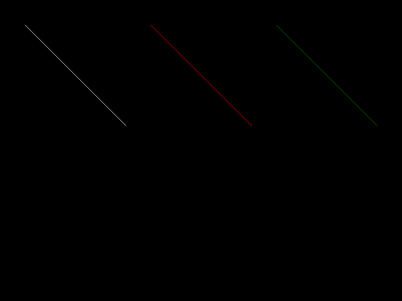
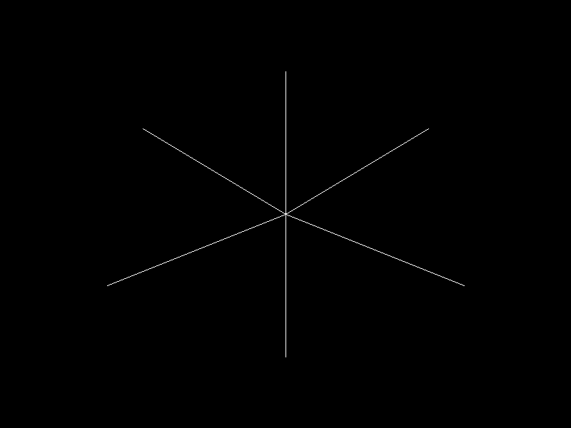

# Algoritmos para Dibujar Líneas en Rust

## Algoritmos implementados

- Ecuación de la recta
- DDA (Digital Differential Analyzer)
- Bresenham (todos los octantes)

## Imagenes
### De Prueba: Comparación de los tres métodos

Cada línea fue dibujada utilizando un algoritmo diferente.

### Figura utilizando Bresenham

Como ejercicio final se utilizó únicamente el algoritmo de Bresenham para dibujar una figura compuesta por varias líneas

